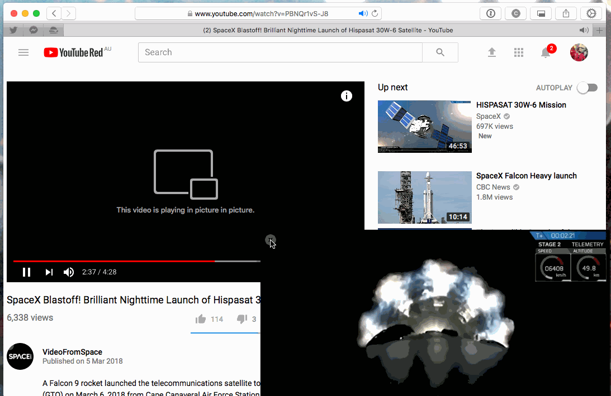

# Little Bow PiP

A Safari extension to activate Picture-in-Picture mode on any video.

## Install/Build

*Note* Apple requires developers to pay $150AUD to join their Developer Program in order to access the certificate required to building a proper extension bundle. Since I am not an Apple Developer I do not possess the certificate required to bundle this extension.

These instructions will load the extension for development but will also allow you to load it (for that session).

1. Open Safari and ensure Developer Mode is enabled
2. Develop -> Show Extension Builder
3. Click the `+` button in the lower left-hand corner
4. Select "Add Extension..." and select this repository
5. Click "Install"
